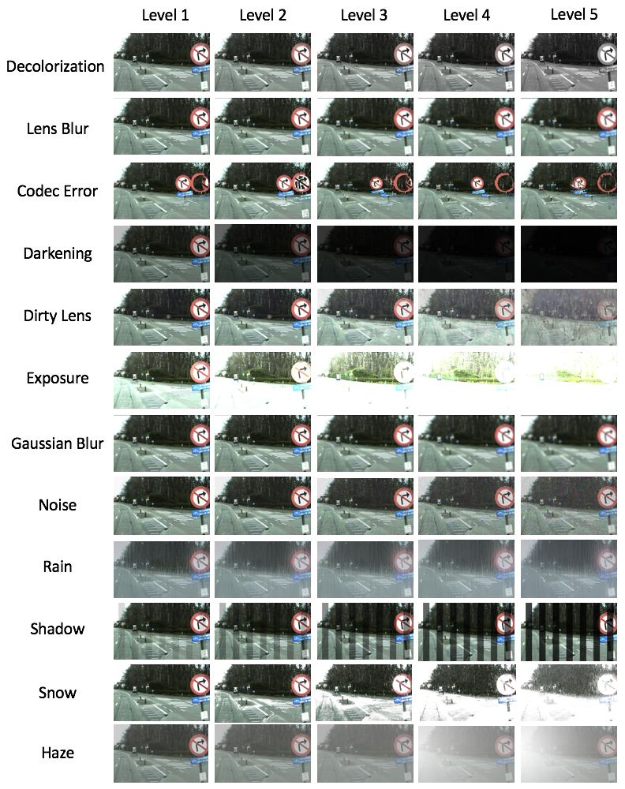
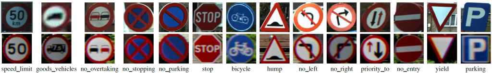
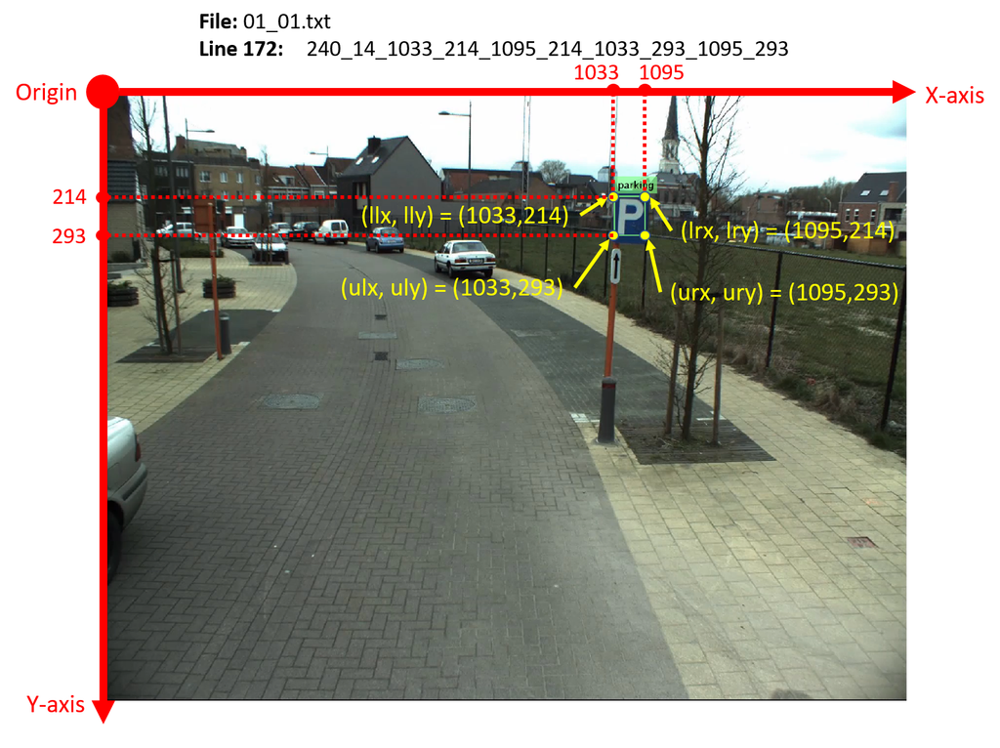

# 6000CEM

## Challenging Conditions

## Traffic Signs

## File Name Format

“sequenceType_sequenceNumber_challengeSourceType_challengeType_challengeLevel.mp4”

* sequenceType:
01 – Real data
02 – Unreal data

* sequenceNumber:
A number in between [01 – 49]

* challengeSourceType:
00 – No challenge source (which means no challenge)
01 – After affect

* challengeType:
00 – No challenge
01 – Decolorization
02 – Lens blur
03 – Codec error
04 – Darkening
05 – Dirty lens
06 – Exposure
07 – Gaussian blur
08 – Noise
09 – Rain
10 – Shadow
11 – Snow
12 – Haze

* challengeLevel:
A number in between [01-05] where 01 is the least severe and 05 is the most severe challenge.

## Coordinate System

## Annotation Format

“sequenceType_sequenceNumber.txt“.

Challenge source type, challenge type, and challenge level do not affect the annotations. Therefore, the video sequences that start with the same sequence type and the sequence number have the same annotations.

* sequenceType:
01 – Real data
02 – Unreal data

* sequenceNumber:
A number in between [01 – 49]

The format of each line in the annotation file (txt) should be: “frameNumber_signType_llx_lly_lrx_lry_ulx_uly_urx_ury”.

* frameNumber:
A number in between [001-300]

* signType:
01 – speed_limit
02 – goods_vehicles
03 – no_overtaking
04 – no_stopping
05 – no_parking
06 – stop
07 – bicycle
08 – hump
09 – no_left
10 – no_right
11 – priority_to
12 – no_entry
13 – yield
14 – parking

## Data Preparation

* Run `move_data.py` to copy only `*.mp4` files with a challenge type in `{"00": "No-challenge", "09": "Rain", "11": "Snow", "12": "Haze"}`. Each file is copied to `challengeType/challengeLevel/sequenceNumber.mp4`

* Run `extract_frames.py` to extract the 300 frames from each `*.mp4` file. Each image is saved as `sequenceNumber_frameNo.jpg`

## Labels Preparation

* Run `rename_labels.py` to change file name from `sequenceType_sequenceNumber.txt` to `sequenceNumber.txt`

* Run `extract_labels.py` to extract each frame labels into one file as `sequenceNumber_frameNumber.txt`

* Run `copy_labels.py` to copy each `sequenceNumber_frameNumber.txt` to each `challengeType/challengeLevel` folder

## Resources

* <https://github.com/olivesgatech/CURE-TSD>
* <https://pytorch.org/hub/ultralytics_yolov5/>
* <https://github.com/ultralytics/yolov5>
* <https://docs.wandb.ai/guides/integrations/yolov5>
